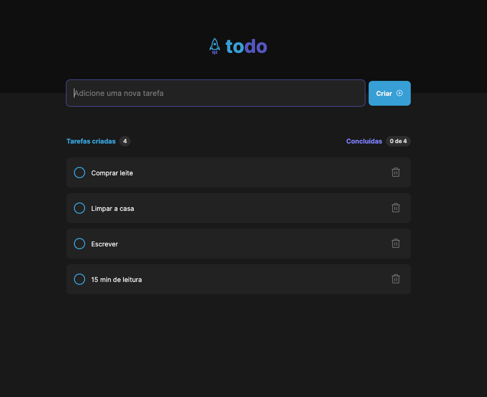

# To Do

---

## Description

In this application you may add your daily task. This one works similar as the Google Tasks application.

---

## Technologies

-> ReactJs

-> Vite

-> TypeScript

-> Tailwind

---

## Run locally

```bash
# clone the repository
git clone ...
# Install all the dependencies
npm i
# Run it
npm run dev

```

## How to use

After installing the application, open your browser in the localhost:5173. When loaded, place your daily tasks, you will be able to add and remove as many tasks you want. Whenever you complete your task, the system will show you how many tasks completed you have.

## Preview


---


